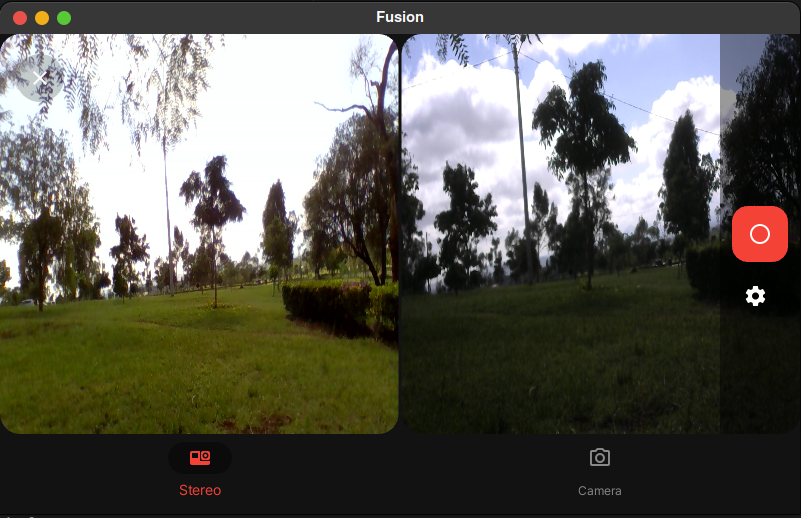
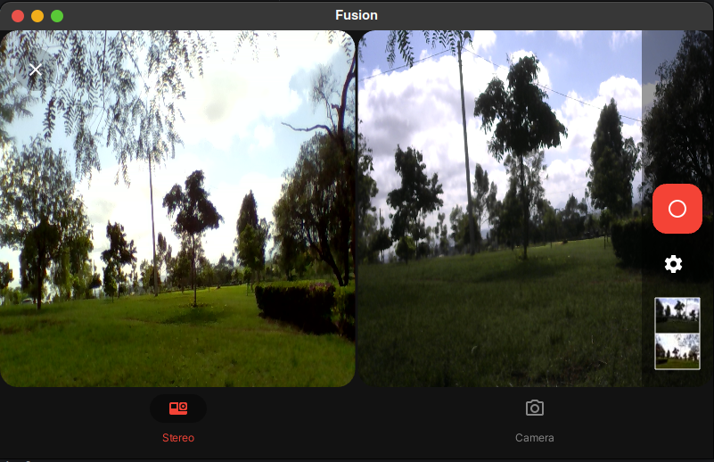
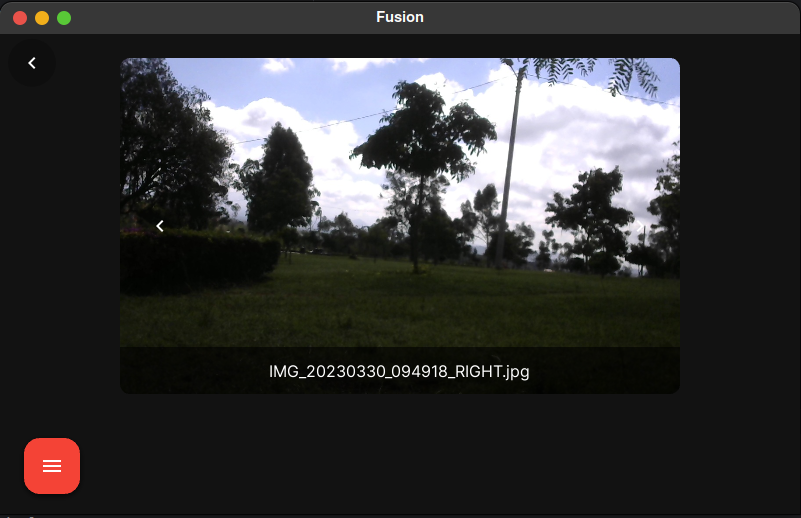
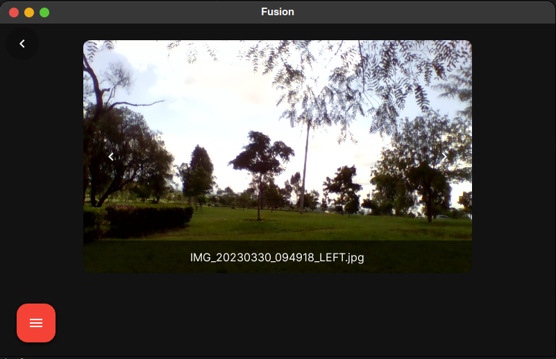
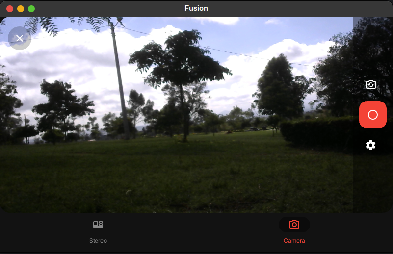

# Fusion App: A data collection software for collecting stereoscopic images of trees
<center>
  <figcaption><i>Fig.1 - Main Screen of Fusion App</i></figcaption>
  
  
<figcaption><em>Fig.2 - Captured Image in Fusion</em></figcaption>
  

  <figcaption><em>Fig.3 - View of captured image (Right image)</em></figcaption>
  

  <figcaption><em>Fig.4 - View of captured image (Left image)</em></figcaption>
  

  <figcaption><i>Fig.5 - Single Camera Screen of Fusion App</i></figcaption>
  
  
</center>

## Introduction
Fusion is a KivyMD based application designed to collect stereoscopic images data of trees that are used in the carbon
stock project.

Stereoscopic images are a pair of images that are taken from slightly different perspectives and when viewed together, 
they create a three-dimensional effect. Stereoscopic images can be captured using special cameras or by taking two 
photographs from slightly different angles. These images are used to create 3D models of objects, which can be used 
in a variety of applications, including virtual reality, gaming, and in the case of Fusion, for the carbon stock project.

The carbon stock project aims to estimate the amount of carbon stored in trees in a given area. This information is 
important for understanding the impact of deforestation on the environment and for developing strategies to combat 
climate change. By using Fusion to capture stereoscopic images of trees, researchers can create 3D models of individual 
trees, which can be used to estimate their volume and carbon content.

Fusion is an easy-to-use application that allows users to capture stereoscopic images of trees and store them in a 
database folder. The application includes features such as image capture, image preview, and image storage, making it an 
essential tool for working on the carbon stock project.

## Software capabilities
- Capture of stereoscopic images
- A view of the captured `left` and `right` images
- Timestamp record of the images taken

## Prerequisites
- ### Main Softwares
  - [Ubuntu 18.04 LTS](https://releases.ubuntu.com/)
  - [Kivy 2.1.0](https://kivy.org/doc/stable/gettingstarted/installation.html#install-pip) and [KivyMD 1.1.1](https://kivymd.readthedocs.io/en/1.1.1/getting-started/)
  - [Opencv Python 4.7.0.68](https://pypi.org/project/opencv-python/)
  
- ### Hardware
  - This Project was tested on the [Jetson Nano](https://developer.nvidia.com/embedded/jetson-nano-developer-kit). You can [Get started here](https://developer.nvidia.com/embedded/learn/get-started-jetson-nano-devkit)
  - A set of two Basic Webcams. [An example](https://www.logitech.com/en-us/products/webcams/c270-hd-webcam.960-000694.html)
  - A power supply

## Installation
Clone the project into your workspace and follow the following steps
```shell
# Create a new directory called fusion for the software
mkdir fusion && cd fusion

# Clone the project inside the new folder
git clone https://github.com/DeKUT-DSAIL/carbon-stock-project.git

# Navigate inside the App folder
cd ForestProjectV2
```
After downloading the project, run the installation script
```shell
# Start the installation process
sh install.sh
```
This steps should now have created a desktop launcher named `Fusion`

To start the software, you can double-click it.

