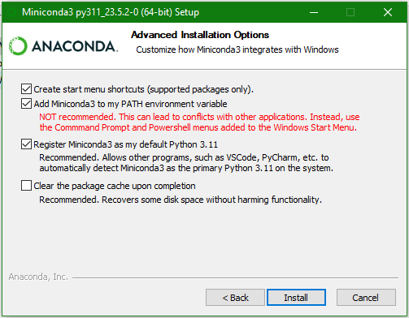

# *DSAIL-TreeVision*: A software tool for extracting tree biophysical parameters of trees from stereoscopic images

## Background
Forest cover reduction poses a threat to environmental and ecological sustainability in Kenya. Various efforts to combat it, including reafforestation, face numerous challenges including prominently, lack of efficient, quick and rapid monitoring to inform timely policy changes by concerned stakeholders. At Dedan Kimathi University of Technology's [Centre for Data Science and Artificial Intelligence (DSAIL)]((https://dsail.dkut.ac.ke/)), we aim to explore various technologies that can be used to improve forest monitoring.

## About *DSAIL-TreeVision*
Stereoscopic vision is a computer vision technique that can be used retrieve the 3D information of a scene based on the concept of Multiple-View Geometry. *DSAIL-TreeVision* was developed to extend the principles of Multiple-View Geometry to facilitate fast and accurate estimation of tree attributes. 

*DSAIL-TreeVision* can accurately estimate the values of the diameter at breast height (DBH), crown diameter (CD), and tree height (CD). The DBH is usually measured at 1.3 m above the trunk base and the algorithms presented in *DSAIL-TreeVision* can estimate this location with impressive accuracy. The algorithms for estimating these parameters are found inside the [Controller/algorithms.py](./Controller/algorithms.py) file

*DSAIL-TreeVision* is built using the [Kivy](https://kivy.org/) and [KivyMD](https://kivymd.readthedocs.io/en/1.1.1/) Python packages. You can learn how to use it by reading [the user guide](./TreeVision%20User%20Guide.pdf)

## The User Interface
*DSAIL-TreeVision* comprises three modules i.e., the `Extract` module for extracting tree biophysical parameters, the `Calibrate` module for calibrating both single and stereo cameras, and the `Capture` module for capturing single and stereoscopic images. Each of these modules are accessed in different screens built in to the user interface. The `Extract` module is the default module displayed when the software is first run.

### 1. Extract Module Interface
Below is a screenshot of the `Extraction interface`. The UI conntains widgets for displaying the left and right images, configuration settings that the user can tweak as desired, and a section for displaying logs such as extraction progress and values of the extracted parameters.


This module begins by deriving depth maps from the stereoscopic images using the semi-global block matching (SGBM) technique, OpenCV's implmentation of [Hirschmuller's algorithm](https://doi.org/10.1109/TPAMI.2007.1166). The rest of the algorithms for extracting the individual tree attributes were developed at [DSAIL DeKUT](https://dsail.dkut.ac.ke/) and can be found inside the [Controller/algorithms.py](./Controller/algorithms.py) module.

### 2. Calibrate Module Interface
Below is a screenshot of the `Calibration interface`. The UI conntains widgets for displaying the calibration images, calibration settings, and logs. The calibration performed by this module is implemented using OpenCV's calibration technique which uses a checkherboard pattern. The method is based on [Zhang's algorithm](https://doi.org/10.1109/34.888718).


### 3. Capture Module Interface
Below is a screenshot of the `Image acquisition interface`. The UI conntains widgets for displaying the left and right and camera streams, or single camera streams. To capture an image, there is a capture button on the right hand side of the screen. Both camera streams are shown in stereo mode while a single stream is shown in single camera mode. 


One can switch between the stereo and single camera modes using the tab switch buttons at the bottom of the screen. In stereo mode, the user can the swap camera streams (make the right camera left, and the left right) using the camera swap button on the right hand side.

## Installing Python
Skip this section if you already have python installed.

### Windows
1. Download the [Miniconda3 setup](https://repo.anaconda.com/miniconda/Miniconda3-py38_23.11.0-2-Windows-x86_64.exe) and double click on it and follow the prompts to install. In the installation prompt, make sure to enable `conda` to be added to the PATH environmental variable as show in the screenshot below.



2. To confirm that Python was installed successfully, open command prompt and run the following command. The output should be the python version 3.8.
```bash
python --version
```

3. If the installation is verified, you can delete the installation file by running the following command on command prompt.
```bash
del Miniconda3-py38_23.11.0-2-Windows-x86_64.exe
```

4. Download the [Git Bash setup](https://git-scm.com/download/win) and install it. Leave the defaults when following the installation prompts. Once installation is complete, proceed to launch `Git Bash`.

5. To initialize `Git Bash` to recognize the `conda` command, running the following command.
```bash
mv ~/.bash_profile ~/.bashrc
conda init
```

6. Close `Git Bash` and reopen it. Run the following command and confirm that there is no error raised.
```bash
conda activate
```

### Linux
1. Download the Miniconda3 installation file by running the following command in your terminal.
```bash
wget https://repo.anaconda.com/miniconda/Miniconda3-py38_23.11.0-2-Linux-x86_64.sh
```

2. Without closing the terminal, run the following command and follow the prompts to install Miniconda3.
```bash
bash Miniconda3-py38_23.11.0-2-Linux-x86_64.sh
```

3. Confirm that python is installed by running this command in terminal. The output should be python version 3.8.
```bash
python --version
```

4. Once Python is installed, you can delete the installation file by running the following command.
```bash
rm Miniconda3-py38_23.11.0-2-Linux-x86_64.sh
```

### Other platforms
Installation instructions for Miniconda3 on all platforms can be found [here](https://docs.conda.io/projects/miniconda/en/latest/).

## Note on Image Segmentation
An important step in the process of extracting tree biophysical parameters from stereoscopic images is image segmentation. It is necessary in order to retain only the foreground pixels (full tree or tree trunks) in the depth maps. The algorithms implemented in *DSAIL-TreeVision* extract the tree parameters from the segmented depth map.

We have incorporated two deep learning segmentation models in this application: Meta's Segment Anything Model (SAM) and the PerceptTreeV1 Mask R-CNN model finetuned on real images.You can read about them here:

* [SAM](https://github.com/facebookresearch/segment-anything)
* [PerceptTreeV1 Mask R-CNN model](https://github.com/norlab-ulaval/PercepTreeV1)

Down below, we have provided instructions on how to download and use their pretrained models in the application.

## Setting Up *DSAIL-TreeVision*
#### Note for Windows Users: Install [`Git Bash`](https://git-scm.com/download/win) before proceeding
1. Open your your file manager/explorer and navigate to  where you would like to save *`DSAIL-TreeVision`* files. 

2. Right click on this location and select `Git Bash Here` if you are on Windows, or `open in terminal` if you are on Linux. This will open `Git Bash` or `Bash` in this location.

3. Now go ahead and clone this github repository. To do this, copy and paste the following command on `Git Bash` or `Bash` and pressing enter. Once the process is complete, the root directory will be saved as `TreeVision`
```bash
git clone https://github.com/DeKUT-DSAIL/DSAIL-TreeVision.git
```

4. Download the pretrained segmentation models:

* Meta's Segment Anything Model (SAM) checkpoint can be downloaded from [here](https://dl.fbaipublicfiles.com/segment_anything/sam_vit_h_4b8939.pth).
* The PercepTree pretrained model can be downloaded from [here](https://drive.usercontent.google.com/download?id=108tORWyD2BFFfO5kYim9jP0wIVNcw0OJ&export=download&authuser=0).

5. Copy the models downloaded in step 4 above to the [assets/models](assets/models) path found in the application's root directory.

6. On command line, open the application's root folder (`TreeVision`) by running the following command:
```bash
cd TreeVision
```

7. On command line, run the `setup.sh` script from the `DSAIL-TreeVision`'s root directory, using the command:
```bash
bash setup.sh
```

8. Activate the virtual environment by running this command:
```bash
conda activate treevision
```

9. *DSAIL-TreeVision* runs inferences on pretrained image segmentation models which require PyTorch and Detectron2 packages. Follow the instructions for [installing PyTorch](https://pytorch.org/get-started/locally/) on your platform and [installing detectron2](https://detectron2.readthedocs.io/en/latest/tutorials/install.html) on Linux or MacOS. Windows users see below.

* **NOTE for Windows users**: There is a Detectron2 fork that can be installed on Windows. You can get the installation instructions [here](https://github.com/augmentedstartups/detectron2).

11. With the virutal environment still active, check that PyTorch and detectron2 were correctly installed by verifying that they import successfully.
```bash
python
import torch
print(torch.__version__)
import detectron2
print(detectron2.__version__)
```

11. If you have commpleted steps 1-8 successfully, you can start *DSAIL-TreeVision* by running the `start.sh` script using the command:
```bash
source start.sh
```
#### Notes for Linux Users 
##### A. Install xclip and xsel
Run these commands to install the 2 packages:
```bash
sudo apt-get install xclip xsel
```

##### B. on libGL errors
Running Kivy applications on Linux requires having the right libGL drivers. You might find that on executing step no.6 above, you run into libGL errors that make *`DSAIL-TreeVision`* fail to start. If this happens, it is because the libGL drivers sought by the system to run the application are missing, or a specific version of the driver is missing. The driver is always installed in the virtual environment during the setup steps, and this setup process sometimes installs the wrong version of the driver. Here are some helpful links to help you go about troubleshooting and solving the problem:
1. [libGL error: failed to load drivers iris and swrast in Ubuntu 20.04](https://askubuntu.com/questions/1352158/libgl-error-failed-to-load-drivers-iris-and-swrast-in-ubuntu-20-04)
2. [Kivy issues with libGL errors](https://github.com/kivy/kivy/issues/7879)
3. [libGL error: MESA-LOADER: failed to open iris](https://stackoverflow.com/questions/72110384/libgl-error-mesa-loader-failed-to-open-iris)

## Test Usage: Parameter Extraction
A folder called `test` is included in *`DSAIL-TreeVision`'s* root directory. It contains a `full_trees` folder of 20 image pairs of full trees from which you can extract CDs and THs, and a `trunks` folder of 10 image pairs of tree trunks and their masks from which you can extract the DBHs. 

By default, the file manager in *DSAIL-TreeVision* opens in the host system's `home` directory. On Windows, this will be the `C:\Users\<USER>` directory (replace \<USER> with the username you used in your PC). On Linux, this will be `/home` directory. By contrast, the test images you will be using in this test phase are found inside the root directory of the application. You will need to navigate form your `home` directory to application's root directory to select your files or folders. You can perform this navigation by clicking on the `back` button on the top left of the file manager user interface.

To test tree parameter extraction on *`DSAIL-TreeVision`*, follow these steps:

1. On the user interface, click on the green `Select project images` button to open the file manager. Navigate to the `TreeVision/test/full_trees` folder and select this folder by pressing the checkmark (tick) button on the bottom right of the screen. This folder has now been selected as the location of the images to be processed.

2. Click on the `Calibrate File (YML)` button and navigate to the `TreeVision/configs/test` folder and click on the `stereo_full_trees.yml` file to select it. This file has now been selected as camera calibration to be used in processing the images uploaded in step 1.

3. Click on the `Select ref values file` button and the scroll down until you find the `TreeVision/test_cd_th.csv` file and click on it. This file has now been selected as the file containing the ground truth values of crown diameter (CD) and tree height (TH) for the trees in the images selected in step 1.

4. Click on the orange `Verify` button. If you followed steps 1-3 correctly and did not modify any of the default settings on the interface, the `Extract` and `Batch Extract` buttons adjacent to the `Verify` button you clicked on should have turned green.

5. Click on the `Batch Extract` button and observe the bottom right (we call this the logging section) of the user interface. You should notice that some information is being added continuously. Further, the images displayed on main image widgets on the screen are changing frequently. This is because *`DSAIL-TreeVision`* is extracting the crown diameters and tree heights of all the trees in the folder you selected in step 1. Once the parameters of one tree are estimated, the software moves to the next tree and displays a new pair of images.

6. Step 5 is complete is complete when you see the message `Batch extraction complete` on the logging section. Notice right image of the pair displayed on the screen. It has annotations added to it, like the one in the image shown below. These annotations are arrows showing the extents and measurements of the tree height and crown diameter. 


7. Notice also that the `Analyse` button adjacent to the `Batch Extract` button has turned orange. Click on it and wait for about 5 seconds. You should now see two plots displayed where the original images of trees were displayed. In the logging section, a statistical summary of the analysis performed is also shown. It is a comparison of the estimated values with the ground truth values provided in step 3.

# Congratulations !!!
You have successfully extracted tree parameters of 20 trees using *DSAIL-TreeVision*.