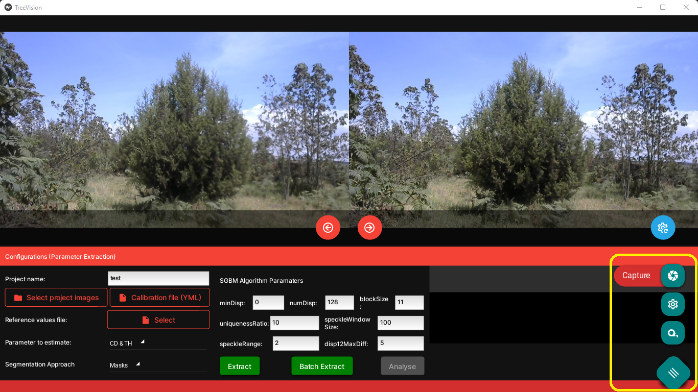

# TreeVision: A software tool for extracting tree biophysical parameters of trees from stereoscopic images

## Background
Forest cover reduction poses a threat to environmental and ecological sustainability in Kenya. Various efforts to combat it, including reafforestation, face numerous challenges including prominently, lack of efficient, quick and rapid monitoring to inform timely policy changes by concerned stakeholders. At Dedan Kimathi University of Technology's [Centre for Data Science and Artificial Intelligence (DSAIL)]((https://dsail.dkut.ac.ke/)), we aim to explore various technologies that can be used to improve forest monitoring.

## About *TreeVision*
Stereoscopic vision is a computer vision technique that can be used retrieve the 3D information of a scene based on the concept of Multiple-View Geometry. *TreeVision* was developed to extend the principles of Multiple-View Geometry to facilitate fast and accurate estimation of tree attributes. 

*TreeVision* can accurately estimate the values of the diameter at breast height (DBH), crown diameter (CD), and tree height (CD). The DBH is usually measured at 1.3 m above the trunk base and the algorithms presented in *TreeVision* can estimate this location with impressive accuracy. The algorithms for estimating these parameters are found inside the [Controller/algorithms.py](./Controller/algorithms.py) file

*TreeVision* is built using the [Kivy](https://kivy.org/) and [KivyMD](https://kivymd.readthedocs.io/en/1.1.1/) Python packages.

## The User Interface
*TreeVision* comprises three modules i.e., the `Extract` module for extracting tree biophysical parameters, the `Calibrate` module for calibrating both single and stereo cameras, and the `Capture` module for capturing single and stereoscopic images. Each of these modules are accessed in different screens built in to the user interface. The `Extract` module is the default module displayed when the software is first run.

The user can switch between screens using the menu button on the bottom right of the UI. This menu button provides links for switching to other modules. See below.



### 1. Extract Module Interface
Below is a screenshot of the `Extraction interface`. The UI conntains widgets for displaying the left and right images, configuration settings that the user can tweak as desired, and a section for displaying logs such as extraction progress and values of the extracted parameters.


This module begins by deriving depth maps from the stereoscopic images using the semi-global block matching (SGBM) technique, OpenCV's implmentation of [Hirschmuller's algorithm](https://doi.org/10.1109/TPAMI.2007.1166). The rest of the algorithms for extracting the individual tree attributes were developed at [DSAIL DeKUT](https://dsail.dkut.ac.ke/) and can be found inside the [Controller/algorithms.py](./Controller/algorithms.py) module.

### 2. Calibrate Module Interface
Below is a screenshot of the `Calibration interface`. The UI conntains widgets for displaying the calibration images, calibration settings, and logs. The calibration performed by this module is implemented using OpenCV's calibration technique which uses a checkherboard pattern. The method is based on [Zhang's algorithm](https://doi.org/10.1109/34.888718).


Before starting camera calibration, the user should provide a project name, select the folder containing calibration images, provide a name for the calibration file. This will the YAML file where the single camera matrix and distortion coefficients will be saved. The rest of settings on the UI can changed according to the user's context. When the calibration of a single camera is going on, the right image widget will be displaying the calibration image with the found chessboard corners superimposed. To start calibration, the user should click on the green `Calibrate Single` button after all the settings are in place. Here is a screenshot of ongoing single camera calibration.


When the calibration is complete, the widgets displaying the right calibration image will display a scatter plot of the calibration errors. See below. Notice that, as in the case of parameter extraction, the calibraton information is displayed in the logging section.


Before clicking on the green `Calibrate Stereo` button, the user needs to select the single camera calibration file using the `Single cam calib file` setting on the UI. This module assumes that both cameras are identical and the selected file is taken to apply to both cameras. The `Calibration filename` input will the filename of the YAML calibration for the stereo camera. As calibration continues, the widgets for displaying the left and right calibration images displays the images with the found chessboard corners superimposed. Here is a screenshot of ongoing stereo calibration.


Here is a screenshot of the completed stereo calibration. Notice that, as in the case of parameter extraction, the calibraton information is displayed in the logging section.


### 3. Capture Module Interface
Below is a screenshot of the `Image acquisition interface`. The UI conntains widgets for displaying the left and right and camera streams, or single camera streams. To capture an image, there is a capture button on the right hand side of the screen. Both camera streams are shown in stereo mode while a single stream is shown in single camera mode. 

One can switch between the stereo and single camera modes using the tab switch buttons at the bottom of the screen. In stereo mode, the user can the swap camera streams (make the right camera left, and the left right) using the camera swap button on the right hand side. 

In single camera mode, one can switch the selected camera using the camera switch button on the right hand side of the screen. In both modes, the cameras can be toggled on and off using the camera toggle button on the right hand side. 

## Dataset
*TreeVision* has been tested and validated on with a dataset obtained from a real forest setting. We have published this dataset on Mendeley Data and it is publicly available for use. The data set is titled [Tree Image Dataset for Biophysical Parameter Estimation using Stereoscopic Vision](https://www.doi.org/10.17632/nx3ggv7pxf.4). Visit this URL and download the zip file called `tree_stereo_image_dataset_v4.zip`. 

## Test Usage
### Setting Up
1 Clone this repository. The root directory will be saved in your computer as `TreeVision`
```bash
git clone https://github.com/DeKUT-DSAIL/TreeVision.git
```

Download our dataset titled [Tree Image Dataset for Biophysical Parameter Estimation using Stereoscopic Vision](https://www.doi.org/10.17632/nx3ggv7pxf.4) from Mendeley Data.

3 Extract all the files from the zipped folder. You will have 4 folders (`full_trees`, `trunks`, `calib_v1`, `calib_v2`) and 2 files (`full_trees.csv`, `trunks.csv`). 

4 Transfer the `full_trees` and `trunks` folders to the root folder of the cloned repository (i.e., the `TreeVision` folder).

5 Open the application's root folder (`TreeVision`) in a terminal application. Use `bash` if you are on Linux or `Git Bash` if you are on Windows. Using `Git Bash` on Windows will make it possible to finish your setup process using the commands in steps 6 and 7.

6 From the application's too directory, run the `setup.sh` script using the command:
```bash
source setup.sh
```

7 Run the `install.sh` script using the command:
```bash
source install.sh
```

### Test Parameter Extraction
A folder called `test` is included in the repository. It contains a `full_trees` folder of 20 image pairs of full trees from which you can extract CDs and THs, and a `trunks` folder of 20 image pairs of tree trunks and their masks from which you can extract the DBHs. Follow these steps:

1 On the user interface, click on the green `Extract` button and watch what happens on the widget at the bottom right of the application. Some information on the extracted CD and Th of the tree displayed on the UI has now been displayed.

2 On the user interface, click on the green `Batch Extract` button. The app will now batch extract the parameters of all 20 trees in the [full_trees](./test/full_trees/) folder and display them on the widget at the bottom right corner. The batch extraction will be complete once the UI is no longer being updated with new images.

3 In your file explorer, navigate to the [results folder](./assets/projects/test/results) to find the [results_cd_th.csv](./assets/projects/test/results/results_cd_th.csv) file and open it. This file contains the extracted parameters of all the 20 full trees. You can open it using MS Excel for a better view. This process can also be repeated for tree trunks by selecting the [trunks folder](./test/trunks/). In this case, the [stereo_sample.yml](./configs/stereo_sample_2.yml) calibration file should be selected and the analysis will be saved in the [results_dbh.csv](./assets/projects/test/results/results_dbh.csv) file. All configuration files in *TreeVision* are saved in the [configs folder](./configs/)


# Congratulations !!!
You have successfully extracted tree parameters of 20 trees using *TreeVision*.