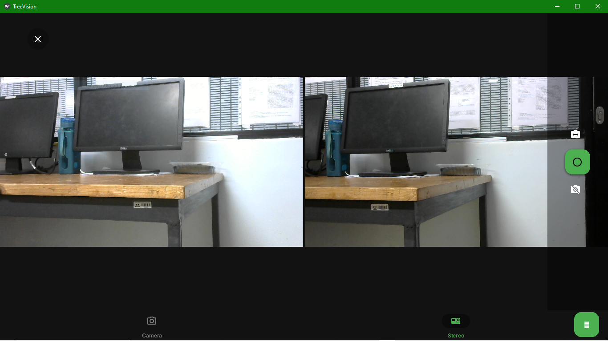

# *DSAIL-TreeVision*: A software tool for extracting tree biophysical parameters of trees from stereoscopic images

## Background
Forest cover reduction poses a threat to environmental and ecological sustainability in Kenya. Various efforts to combat it, including reafforestation, face numerous challenges including prominently, lack of efficient, quick and rapid monitoring to inform timely policy changes by concerned stakeholders. At Dedan Kimathi University of Technology's [Centre for Data Science and Artificial Intelligence (DSAIL)]((https://dsail.dkut.ac.ke/)), we aim to explore various technologies that can be used to improve forest monitoring.

## About *DSAIL-TreeVision*
Stereoscopic vision is a computer vision technique that can be used retrieve the 3D information of a scene based on the concept of Multiple-View Geometry. *DSAIL-TreeVision* was developed to extend the principles of Multiple-View Geometry to facilitate fast and accurate estimation of tree attributes. 

*DSAIL-TreeVision* can accurately estimate the values of the diameter at breast height (DBH), crown diameter (CD), and tree height (CD). The DBH is usually measured at 1.3 m above the trunk base and the algorithms presented in *DSAIL-TreeVision* can estimate this location with impressive accuracy. The algorithms for estimating these parameters are found inside the [Controller/algorithms.py](./Controller/algorithms.py) file

*DSAIL-TreeVision* is built using the [Kivy](https://kivy.org/) and [KivyMD](https://kivymd.readthedocs.io/en/1.1.1/) Python packages.

## The User Interface
*DSAIL-TreeVision* comprises three modules i.e., the `Extract` module for extracting tree biophysical parameters, the `Calibrate` module for calibrating both single and stereo cameras, and the `Capture` module for capturing single and stereoscopic images. Each of these modules are accessed in different screens built in to the user interface. The `Extract` module is the default module displayed when the software is first run.

### 1. Extract Module Interface
Below is a screenshot of the `Extraction interface`. The UI conntains widgets for displaying the left and right images, configuration settings that the user can tweak as desired, and a section for displaying logs such as extraction progress and values of the extracted parameters.


This module begins by deriving depth maps from the stereoscopic images using the semi-global block matching (SGBM) technique, OpenCV's implmentation of [Hirschmuller's algorithm](https://doi.org/10.1109/TPAMI.2007.1166). The rest of the algorithms for extracting the individual tree attributes were developed at [DSAIL DeKUT](https://dsail.dkut.ac.ke/) and can be found inside the [Controller/algorithms.py](./Controller/algorithms.py) module.

### 2. Calibrate Module Interface
Below is a screenshot of the `Calibration interface`. The UI conntains widgets for displaying the calibration images, calibration settings, and logs. The calibration performed by this module is implemented using OpenCV's calibration technique which uses a checkherboard pattern. The method is based on [Zhang's algorithm](https://doi.org/10.1109/34.888718).


### 3. Capture Module Interface
Below is a screenshot of the `Image acquisition interface`. The UI conntains widgets for displaying the left and right and camera streams, or single camera streams. To capture an image, there is a capture button on the right hand side of the screen. Both camera streams are shown in stereo mode while a single stream is shown in single camera mode. 



One can switch between the stereo and single camera modes using the tab switch buttons at the bottom of the screen. In stereo mode, the user can the swap camera streams (make the right camera left, and the left right) using the camera swap button on the right hand side.

## Setting Up and Installation
#### Note for Windows Users: Install [`Git Bash`](https://git-scm.com/download/win) before proceeding
1. Clone this repository. The root directory will be saved in your computer as `TreeVision`
```bash
git clone https://github.com/DeKUT-DSAIL/DSAIL-TreeVision.git
```

2. Open the application's root folder (`TreeVision`) in a terminal application. Use `bash` if you are on Linux or `Git Bash` if you are on Windows. Using `Git Bash` on Windows will make it easier to finish the setup process.

3. In the terminal, run the `setup.sh` script from the TreeVision's root directory, using the command:
```bash
bash setup.sh
```

4. Run the `start.sh` script using the command:
```bash
source start.sh
```

## Test Usage: Parameter Extraction
A folder called `test` is included in `DSAIL-TreeVision`'s root directory. It contains a `full_trees` folder of 20 image pairs of full trees from which you can extract CDs and THs, and a `trunks` folder of 10 image pairs of tree trunks and their masks from which you can extract the DBHs. Follow these steps:

1. On the user interface, click on the green `Select project images` button to open the file manager. Navigate to the `TreeVision/test/full_trees` folder and select this folder by pressing the checkmark (tick) button on the bottom right of the screen. This folder has now been selected as the location of the images to be processed.

2. Click on the `Calibrate File (YML)` button and navigate to the `configs/test` folder and click on the `stereo_full_trees.yml` file to select it. This file has now been selected as camera calibration to be used in processing the images uploaded in step 1.

3. Click on the `Select ref values file` button and the scroll down until you find the `test_cd_th.csv` file and click on it. This file has now been selected as the file containing the ground truth values of crown diameter (CD) and tree height (TH) for the trees in the images selected in step 1.

4. Click on the orange `Verify` button. If you followed steps 1-3 correctly and did not modify any of the default settings on the interface, the `Extract` and `Batch Extract` buttons adjacent to the `Verify` button you clicked on should have turned green.

5. Click on the `Batch Extract` button and observe the bottom right (we call this the logging section) of the user interface. You should notice that some information is being added continuously. Further, the images displayed on main image widgets on the screen are changing frequently. This is because *`DSAIL-TreeVision`* is extracting the crown diameters and tree heights of all the trees in the folder you selected in step 1. Once the parameters of one tree are estimated, the software moves to the next tree and displays a new pair of images.

6. Step 5 is complete is complete when you see the message `Batch extraction complete` on the logging section. Notice right image of the pair displayed on the screen. It has annotations added to it, like the one in the image shown below. These annotations are arrows showing the extents and measurements of the tree height and crown diameter. 


7. Notice also that the `Analyse` button adjacent to the `Batch Extract` button has turned orange. Click on it and wait for about 5 seconds. You should now see two plots displayed where the original images of trees were displayed. In the logging section, a statistical summary of the analysis performed is also shown. It is a comparison of the estimated values with the ground truth values provided in step 3.

# Congratulations !!!
You have successfully extracted tree parameters of 20 trees using *DSAIL-TreeVision*.